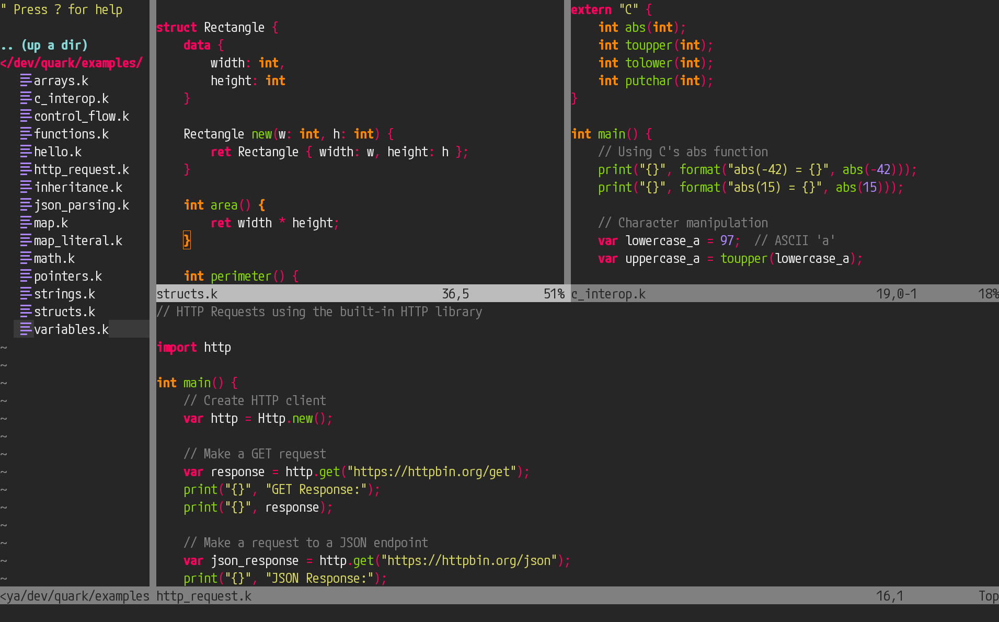

# Quark.vim

Syntax highlighting for the [Quark programming language](https://github.com/richardhbtz/quark).

## Preview


## Installation

With [vim-plug](https://github.com/junegunn/vim-plug):
```
Plug 'pra1rie/quark.vim'
```

### Manual installation

* Copy files to your `~/.vim` directory.

## Configuration

Highlight brackets as operators with:
```
let g:quark_highlight_brackets=1
```

Highlight semicolons and commas as operators with:
```
let g:quark_highlight_separators=1
```

